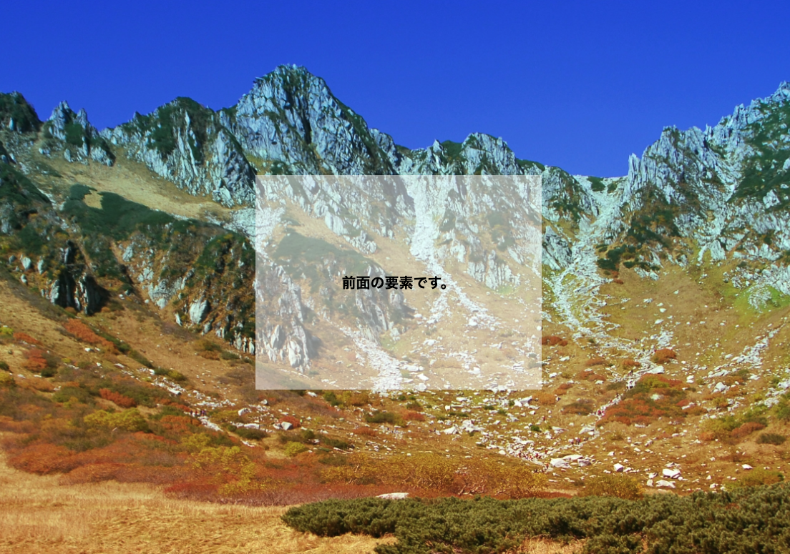
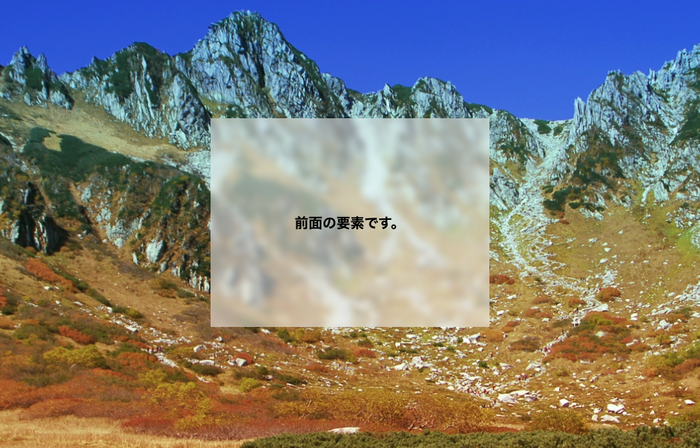

## はじめに

こんにちは！`やっぴー`です！
サイトや LP を制作していたり、ポートフォリオページを作っていたりするとき、すりガラスのような表現をしたいと思ったことはありませんか？  
例えば、モーダルを若干透過させるのではなく、背面にあるものをぼかしたり、ドロワーメニューを開いた時メニュー以外の要素はぼかしたいなどなど使う場面は色々です。  
そんな時に解決する CSS プロパティを今回ご紹介します！

### backdrop-filter ですりガラス表現

早速実装ですが、なんと[backdrop-filter](https://developer.mozilla.org/ja/docs/Web/CSS/backdrop-filter)の blur を前面の要素に適用させるだけですりガラスのような表現が可能です！  
まずは、背面要素と前面要素を用意します。とりあえず、簡単に効果がわかりやすいように背面は画像を配置します。

```html
<div class="front-elem">
  <p>前面の要素です。</p>
</div>
<div class="back-elem">
  
</div>
```

```scss
*,
*::before,
*::after {
  margin: 0;
  padding: 0;
}

.front-elem {
  position: fixed;
  left: 50%;
  top: 50%;
  transform: translate(-50%, -50%);
  width: 400px;
  height: 300px;
  background-color: rgba(255, 255, 255, 0.5);

  display: flex;
  justify-content: center;
  align-items: center;

  p {
    font-size: 20px;
    font-weight: bold;
  }
}

.back-elem {
  width: 100%;
  height: 100vh;

  img {
    width: 100%;
    height: 100%;
    object-fit: cover;
  }
}
```


モーダルのように作りましたが、前面要素の背景に背面要素がかなりくっきりと見えるので情報が頭に入りにくい...  
では、backdrop-filter を効かせましょう。

```scss
.front-elem {
  ...
  /* これだけ追加 */
  backgrop-filter:blur(5px);
}
```


あっという間にすりガラス表現の完成！  
これで前面要素に重なった背面要素にぼかしが効くので、ある程度透過された背景でも情報がスッと入りやすくなります。  
しかも、おしゃれに見えるのでデザインとして取り入れることも簡単にできそうです。

## 終わりに

今回は backdrop-filter の中でも blur に注目しましたが、ほかにも invert()、grayscale()など様々な効果を適用させることができます。blur 以外にも気になった方々は、ぜひ調べてみてください！
