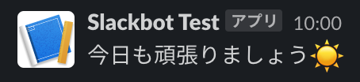
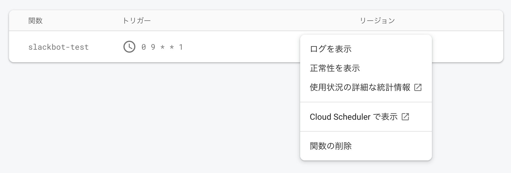
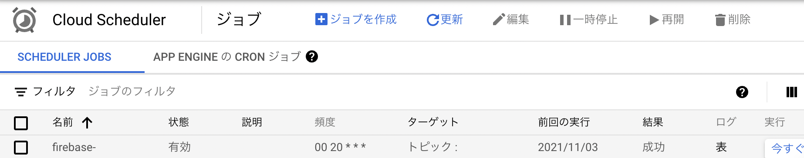

## はじめに
こんにちは！motoiです。実はもうすぐ新メンバーがジョインするんです！！まだ正式に決まったわけではないですが、その際にはぜひここでもご挨拶を…

さて、やってみた系の話も少しずつ紹介していこうかなということで、今回はCloud Functions for Firebaseを使って、Slackのbotを作ってみた話をしたいと思います！

## 手順
まずおおまかな手順をいかに示します。
1. Functionsの環境を用意(Node.jsをTypeScriptで)
2. `functions.pubsub`を使用して関数をスケジューリング
3. Slack APIをたたく

Functionsの環境を用意する手順は、ここでは割愛します。特段必要がない限り、FunctionsはNode.jsで言語はTypeScriptを採用しています。
### functions.pubsub
基本的には[公式](https://firebase.google.com/docs/functions/schedule-functions?hl=ja)に従います。

```typescript:title=index.ts
exports.scheduledFunction = functions.pubsub.schedule('every 5 minutes')
.onRun((context) => {
   ~~~
})
```

たったこれだけで5分おきに実行される関数が作れました！！

scheduleの引数には[App Engine構文](https://cloud.google.com/appengine/docs/flexible/custom-runtimes/configuring-your-app-with-app-yaml?hl=ja)、あるいは[unix-cron形式](https://cloud.google.com/scheduler/docs/configuring/cron-job-schedules?&_ga=2.32681150.-1863898187.1631346775&_gac=1.47456597.1633531396.CjwKCAjwkvWKBhB4EiwA-GHjFnz6CFsFzeuBn38ONT91eh5eVJdirdPWvUJjX_8LK_gmXpdOHDpxXRoCiscQAvD_BwE#defining_the_job_schedule)が使用できます。後者で設定した場合、デフォルトのタイムゾーンが`America/Los_Angeles`になるので、必要であれば、`timeZone`プロパティで設定します。timeZoneの引数で設定できるのはtz databaseのタイムゾーンであり、例えば東京は、`Asia/Tokyo`です。

```typescript:title=index.ts
exports.scheduledFunctionCrontab = functions.pubsub.schedule('0 11 * * *')
.timeZone('Asia/Tokyo')
.onRun((context) => {
  ~~~
})
```

例えば上記だと、毎日東京時刻の午前11時に関数が実行されます。

[[alert | timeZoneが効かない]]
| 上記のようにtimeZoneを設定しても、なぜかデフォルトのロサンゼルス時間のままでした…後に紹介する方法で手動でタイムゾーンを変更しましたが、どなたか解決方法知っている方いたら教えて下さい…！

### Slack API
[Slack App](https://api.slack.com/apps)を作成し、botを投稿したいワークスペースのチェンネルを選択し、Webhookを作成します。このあたりの手順も記事に書きたいと思いますが、一旦今は割愛します。

上記で得たWebhook URLを環境変数に設定します。Functionsの環境変数の設定の仕方は以前[こちらの記事](https://dev.plus-class.jp/env-cloud-functions/)で紹介した通りです。

```typescript:title=index.ts
exports.firstReminder = functions.region('asia-northeast1').pubsub.schedule('0 10 * * *')
.timeZone('Asia/Tokyo')
.onRun(async (context) => {
  if (!judgeHoliay()) {
    const array = [
      `今日も頑張りましょう☀️`,
    ]
    const data = {
      text: array.join('\n')
    }
    const slackAPI = functions.config().slack_app.api
    await axios.post(
      slackAPI,
      data,
      {
        headers: { 'Content-type': 'application/json' }
      }
    )
  }

  return null
})
```

上記が実際のコードです。毎日10時になったら「今日も頑張りましょう☀️」とbotが挨拶してくれます(下画像)。4行目の`judgeHoliday()`は別で定義した関数で、土日祝日も関係なく毎日このfunctionは走るので、土日祝日の場合は、Webhookをたたかないようにしています。後は見ての通りです。環境変数のWebhook URLにaxiosでpostしています。



[[info | 祝日の取得]]
| 日本の祝日の取得は、`@holiday-jp/holiday_jp`を使っています。[npm等でインストール](https://www.npmjs.com/package/@holiday-jp/holiday_jp)できます。

### Firebaseのコンソールで確認してみる
上記を記述したfunctionをデプロイし、Firebaseのコンソールで確認してみると、トリガーに時計マークがついていました。そして、設定を開いてみると、「Cloud Schedulerで表示」という項目が。GCPにCloud Schedulerという機能があり、そちらで管理が可能です。編集をすれば、先ほどの`schedule`の引数と`timeZone`の引数がコンソール側で設定できます。先述の通り、`timeZone`がうまく設定されなかったので、この方法を使って手動で設定しています。





## Next Dev's HINT...
どうでしたでしょう。Cloud FunctionsとSlack APIを使えば、非常に簡単にbotを作ることができました。APIをたたくだけなので、もちろんSlack以外も簡単にできます。次回は…またまた未定です笑 (もはやNext Dev's HINTというタイトルやめようかな…コナンを真似したんだけど…)

---
