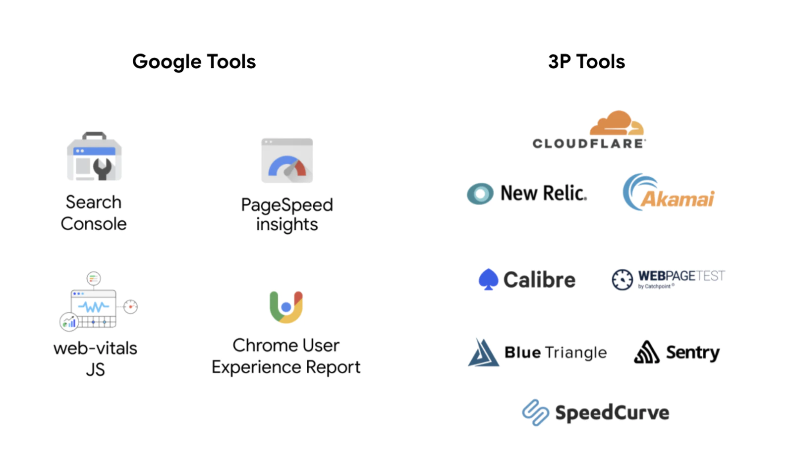

こんにちは。GORANです。今日は僕の1番好きな**Webパフォーマンスの話**をします。
約1年前に[個人ブログの方で触れたWeb Vitalsの話題](https://goran-nasai.com/web/performance/web-vitals)がより注目されるようになってきてまして（結構予想当たって嬉しい）、執筆時よりかなり情報もアップデートされておりますので、この1年のキャッチアップをしたいなと思います。

## ランキング要因に
最も注目すべき変更点は[ページエクスペリエンスによるランキング方式への導入](https://developers.google.com/search/blog/2021/04/more-details-page-experience)でしょう。ここは予想通りというか、必然でしたね。GoogleがAMPを強烈に推し始めた時点で、どういった形であれ表示速度がSEOへ影響を与えることを察していた方も多いのではと思います。

[[notice | AMPよ、永遠に。]]
| このアップデートにより、これまで優遇されていたAMPの検索体験（AMPバッジやトップニュースカルーセルなど）がフェードアウトしていくことも発表されました。もともとAMPは非常にエクスペリメンタルな取り組みであり、さまざまなデータを取得していましたが、その結果としてWebパフォーマンス（特に表示速度）をいちランキング要因までに押し上げたのはとんでもない功績です。またこれによって巷ではAMPオワコンのようなことも囁かれてますが、僕はまだまだ伸びがあると思ってます。理由は別記事で書きます。

## ビジネスへのインパクト
[ケーススタディも充実してきました](https://web.dev/vitals-business-impact/)。「ランキング要因になり得る」という説明しかできなかった1年前から「SEOに影響を与える」と明言できるようになり、さらには**「売上が上がる」**といった説得材料も獲得してきています。

### ページではなく旅である
その背景には[Journeys, not pages](https://blog.chromium.org/2020/05/the-science-behind-web-vitals.html)という概念があり、個人的にはそれが昨今のWebを象徴していると思っています。モダンなJavaScriptによるリッチな体験はもちろん素晴らしいですが、古き良きHTMLによる**高速なWeb体験も強く望まれる**潮流があるのではないでしょうか。その最たる例が[Jamstack](https://jamstack.org/)のトレンドぶりです。このサイトもJamstackですが、smoothでcleanな素晴らしいアイディアです。まだまだ流行るでしょうね。Jamstackの基本原理`pre-rendering`と`decoupling`についても今度掘り下げたいです。

## CLSの定義変更
Core Web Vitalsには
- LCP
- FID
- CLS

という3つの指標がありますが、[CLSについての定義変更がありました](https://web.dev/evolving-cls/)。具体的には、`session window`という新たな概念が追加されました。これは割と策定当初から議論されていたもので、特に無限スクロールのような体験を考慮したアップデートでしょう。最初の定義ではCLSは累積値であり、無限スクロールのように半永久的に続くコンテンツでは無限にポイントが悪くなってしまうような定義でした。ちなみに、この変更によってポイントが落ちるページはないと公表されています。

## 計測方法の多様性
基本的には上記の3つの指標を追いかけていきますが、さまざまな計測ツールが存在してどれを使おうか迷ってしまいます。

その中でも僕が使っているものが以下の4つです。

- Search Console
- PageSpeed insights
- Lighthouse
- Web Vitals Extension

それぞれ特徴がありますので以下に。

### Search Console
1番ざっくり見るツール。CrUXのデータをURLのグループ単位で表示してくれますし、エラーもわかりやすいです。勘所を掴みたい時に見ます。

### PageSpeed Insights
特定のページの状態を見るツール。URLでの計測が可能です。計測処理がマシンの状態に依存しないので、ある程度再現性のある結果になります。直近28日間のCrUXデータが表示されます。

### Lighthouse
Chrome DevTools。1番簡単で開発環境から使えるツール。マシンの状態に依存するのが玉に瑕。

### Web Vitals Extension
常にCWVをチェックするためのツール。Chromeの拡張機能。規模の大きいサイトで緑だとすごいなーと思う。

より詳細に見たい場合は以下のツールも良いかもしれません。

- ChUX Dashboard
- WebPageTest

### ChUX Dashboard
Chrome UX Reportの生データを見れます。月やデバイスごとにフィルタをかけられるので長期間の傾向を掴むのに向いています。

### WebPageTest
APIが使えるので「GASを使ってスプレッドシートに吐き出して定点計測」みたいなことも可能。CWV以外のパフォーマンス指標も見れます。

## 今後の予想
パフォーマンスがそのページへ与える影響は大きくなり続けると思います。ランキングへの重みが変わったり、新たな指標が導入されるかもしれません。個人的にFIDはアップデートあるんじゃないかなと思ってます。例えば、計測対象を最初だけでなく全てのインプットに対する遅延に拡張とか。CWVについては毎年アップデートすることが明言されているので、ユーザーエクスペリエンスにおける速度体験の比重は大きくなる一方でしょう。

また、[Signed Exchangeを使用することでGoogle検索でコンテンツがプリフェッチされる](https://developers.google.com/search/docs/advanced/experience/signed-exchange?hl=ja)ようになったことは注目すべき事実です。こちらはAMPからの文脈が強いですが、検索体験で優遇されることは開発者にとって非常に重要ですし、**「プライバシー保護しつつ、より高速な体験を」**という意図が汲み取れます。AMPみたいにバッジがついたりするかも知れないですね。

もっと大きな視野で、Googleは率先してWebの体験を変えていこうとしていますから、[Project Fugu](https://web.dev/fugu-status/)にも注目です。[実装されつつあるFugu API](https://fugu-tracker.web.app/)を眺めて、未来のWebに思いを馳せましょう。

このまま発散しそうなので、この辺で。表示速度への注目度が高まってきていてすごく嬉しい今日この頃です。

---