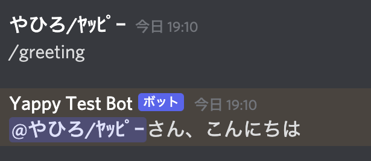

こんにちは、`やっぴー`です。
最近、Discord botを作ってみたいという思いがあり、Discord.pyというライブラリを利用したbot制作に触れてみましたので紹介します。

[[notice | 前提]]
| 本記事は、Pythonの基礎知識を前提としています。

## 実装の前に

早速、botの実装と言いたいところですが、その前に、[discord developer](https://discord.com/developers/applications)サイトでトークンを取得する必要があります。

まず、DeveloperサイトのApplicationsにあるNew Applicationから名前を入力してアプリを作ります。
  
左のメニューからBotを選択し、Add BotからBotを追加します。
  
Botの設定画面が開くので、ここで任意のアイコン画像や名前などを設定します。また、この時、TokenのCopyを押して、Tokenを控えておいてください。  
※Tokenは他人に教えないようにしてください。もし、間違って見せてしまった場合は、Regenerateボタンから再生成してください。
  
次にBotをサーバーに招待します。
左のメニューからOAuth2のOAuth2 URL Generatorを開き、ScopesのBotにチェックを入れます。
  
すると、下にチェックリストが出てくるので、Botに付与したい権限にチェックを入れます。
  
選択した後に、右下にあるCopyからURLを控え、ブラウザで開きます。  
すると、Botの招待画面が表示されるので、サーバーを選択し、進めると招待できます。
  
その後、オフラインのBotが追加されればDiscord側の準備はOKです。
  

## 実装
まず、discord.pyをインストールします。
```
pip install discord.py
```
任意の場所にpythonファイルを用意し、
BOTの起動時にコンソール上に「Hello」と出力させてみます。
```python:title=bot.py
import discord

TOKEN = 'xxxxxx' #　控えておいたToken

client = discord.Client()

#起動時のイベント
@client.event
async def on_ready():
  print('Hello')

client.run(TOKEN)
```
このように、discordをインポートし、クライアントを用意した後、
イベントに対して処理を追加します。
そして最後にクライアントにTokenを渡して実行させます。  
そして、  
`python bot.py`  
というようにファイルを実行させると、表示されたコンソールに'Hello'と出てくると思います。
  
さらに、discord側も見てみるとBotがオンラインになっているはずです。
  
これでBotが作れました！

### 決まったメッセージに反応させたい
Botを起動させることができましたが、このままでは起動時にHelloと言わせることしかできません。そこで、`/greeting`とメッセージを入力したときに、メッセージを送った人に対してメンションをつけて、`〇〇さん、こんにちは`と答えるようにしてみます。  
メッセージに反応させるためには`on_message関数`を用意し、メッセージ内容と送信者の情報を受け取って、決まった文言に一致するときにBotからメッセージ送信させます。

```python:title=bot.py
@client.event
async def on_message(message):
  msg_txt = message.content
  msg_author = message.author

  # botからのメッセージは処理させない
  if msg_author.bot:
    return

  if msg_txt == '/greeting':
    await message.channel.send(f'{msg_author.mention}さん、こんにちは')
```
この処理を追加した上で実行させます。
そして、discord側で`/greeting`と送ると、botからの返信が答えてくれるようになりました。
  
まだまだイベント関数は他にもあり、応用の仕方はありますが、今回は導入の部分だけになります！

## 最後に
普段友達とゲームをするときによく使われるDiscordですが、面白いBotを作ったりすることで話のネタになったり、便利なBotを作ることでサーバー内をより充実させることができますので、もし興味がありましたらこれをきっかけにBot制作してみてはどうでしょうか！

---
