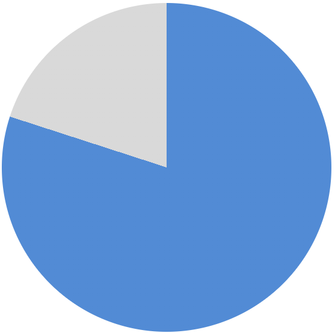

## はじめに

こんにちは！`やっぴ`ーです！
今回は簡単に円グラフを再現する CSS を紹介しようと思います。

### conic-gradient

[conic-gradient](https://developer.mozilla.org/ja/docs/Web/CSS/gradient/conic-gradient)は、linear-gradient のように背景にグラデーションを施す関数ですが、conic-gradient は中心点を回るようにグラデーションが広がります。これが、円グラフ再現のキーとなります。

```css:title=conic-gradient
.pie {
  width: 500px;
  height: 500px;

  background: conic-gradient(#528bd5 0% 80%, #d9d9d9 80% 100%);
}
```


なんとこれだけで四角グラフ（？）の出来上がり。  
さらに、border-radius を 50%にしてあげれば、、、

```css:title=conic-gradient
.pie {
  ...
  border-radius: 50%;
}
```

あっという間に、円グラフの完成！


## もう一歩進める(radial-gradient)

[radial-gradient](https://developer.mozilla.org/ja/docs/Web/CSS/gradient/radial-gradient)は、中心から外側に広がっていくグラデーションで、これをうまく使うとドーナツ型のグラフができる。

```css:title=donuts
.donuts {
  background: radial-gradient(#f2f2f2 0% 30%, transparent 30.3% 100%), conic-gradient(#528bd5 0% 80%, #d9d9d9 80% 100%);
}
```


## 終わりに

これまで地道に css で作っていたものが、実は簡単に数行で再現できることに気づくたびに、css は奥が深いと思っています。css の他にも VR や AI などさまざまな技術に興味があるので、これ面白い！便利！って思ったものはどんどん紹介していきます！
