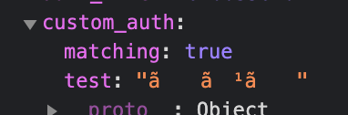

## はじめに
こんにちは！motoiです。今回もFirebase関連の話を。そうです。僕はFirebaseが好きなんです。AWS派の方、まだ間に合います。ぜひGCP/Firebaseを。
今回は、Firebaseを使ったアプリケーション開発をより拡張するためのカスタムクレームという機能をご紹介します。
## カスタムクレーム
基本的には[公式](https://firebase.google.com/docs/auth/admin/custom-claims?hl=ja)の内容に沿います。
### ユーザー情報を拡張できる
端的に言うと、Firebase Authenticationを拡張するための機能です。FirebaseのAuthenticationを使ってユーザーを作成すると、デフォルトでいくつかの値がユーザー情報に乗っかっています。その情報は、Firebase JS SDKの`currentUser`プロパティを用いて、以下のように取得することができます。

```js:title=index.js
const user = firebase.auth().currentUser;
if (user !== null) {
  // The user object has basic properties such as display name, email, etc.
  const displayName = user.displayName;
  const email = user.email;
  const photoURL = user.photoURL;
  const emailVerified = user.emailVerified;

  // The user's ID, unique to the Firebase project. Do NOT use
  // this value to authenticate with your backend server, if
  // you have one. Use User.getToken() instead.
  const uid = user.uid;
}
```

カスタムクレームを使えば、これらの値を任意に拡張することができます。例えば、`auth`というカスタムクレームを作り、`admin`と`editor`でフロントにて実行可能領域を分けることができます。

### Firebase JS SDK と Firebase Admin SDK
実際にカスタムクレームを付与する前に、Firebase JS SDKとFirebase Admin SDKについて触れておくことが必要でしょう。平たく言うと、Firebaseの機能の中でも、ユーザーの作成やユーザー情報そのものの操作等のセキュアな内容を扱うライブラリがFirebase Admin SDKです。[公式](https://firebase.google.cn/docs/admin/setup?hl=ja)では'**priviledged environments**'(特権環境)と表現されているサーバーのみで動かすことができ、フロント側でFirebase Admin SDKのライブラリを使用することはできません。そこで、Cloud Functionsを使って動かすことになるのですが、詳しくはまた別の記事で。

察しのよい方はお気づきかと思いますが、カスタムクレームもFirebase Admin SDKを使うことでしか付与することができません。先述の通り、カスタムクレームはユーザー情報の拡張であり、Firebase Admin SDKの守備範囲に分類されるためです。

### カスタムクレームの付与
さて、実際に付与してみましょう。非常に簡単です。以下のjsを用意し、Cloud Functionsにデプロイして使用します。`setCustomUserClaims`メソッドはFirebase Admin SDKのメソッドです。

```js:title=custom_claim.js
const customClaimObj = {
    auth: 'admin',
    type: 'customer'
}

auth
  .setCustomUserClaims(uid, customClaimObj)
  .then(async () => {
  })
  .catch((error) => {
    console.log('ERROR to update partner user: ', error)
  })
```

はい、たったこれだけで、`customClaimObj`で定義した`auth`と`type`がユーザー情報に付与されます。これで、フロント側では、先程の`currentUser`を使ってユーザーの`auth`や`type`を取得し、表示させるページを限定したり、実行できるメソッドを制限したり、より柔軟なユーザー管理を行うことが可能になりました。

### カスタムクレームはいつでも上書きされる
非常に重要な注意点です。カスタムクレームは常に前の情報に上書きされるので、新しく付与しようとして、上記のjsを実行すると前に登録したカスタムクレームは消えてしまいます。そこで、新しく別のカスタムクレームを付与するためには、現在設定されているカスタムクレームを取得し、再度一緒に付与してやる必要があります。

```js:title=custom_claim_addition.js
const additionalObj = {...customClaimObj, ...addition}

auth
  .setCustomUserClaims(uid, additionalObj)
  .then(async () => {
  })
  .catch((error) => {
    console.log('ERROR to update partner user: ', error)
  })
```

### 登録可能な値と型
基本、Firestoreで用意されている型はすべて登録が可能です。オブジェクト型や配列型に加えて、それらがネストされていても登録が可能です。ただし、値に日本語を入れると以下のように文字化けしてしまうので注意が必要です。



## Next Dev's HINT...
カスタムクレームを使えばアプリケーションの幅をとてつもなく広げることが可能なので、ぜひご活用のほど。次回も多分Firebase関連の記事にしますねこの調子じゃ。

---
