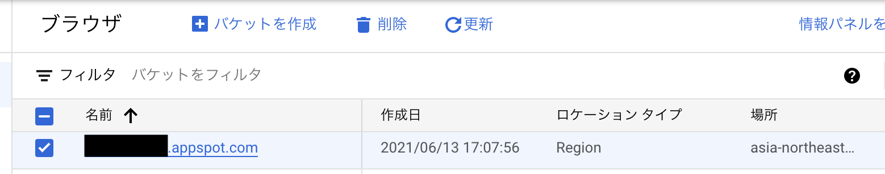
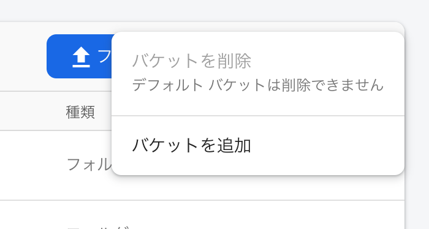
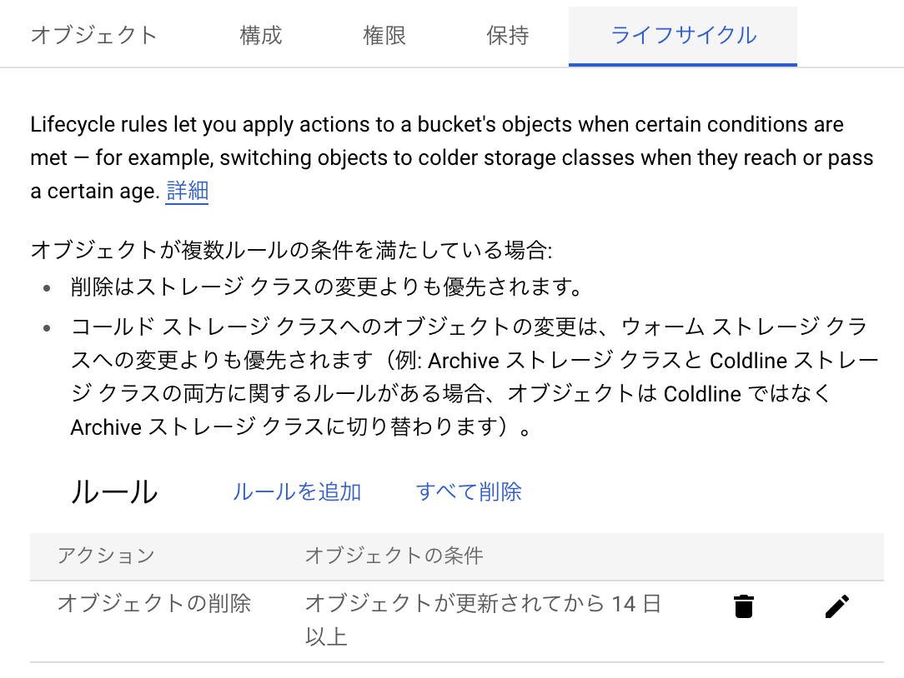
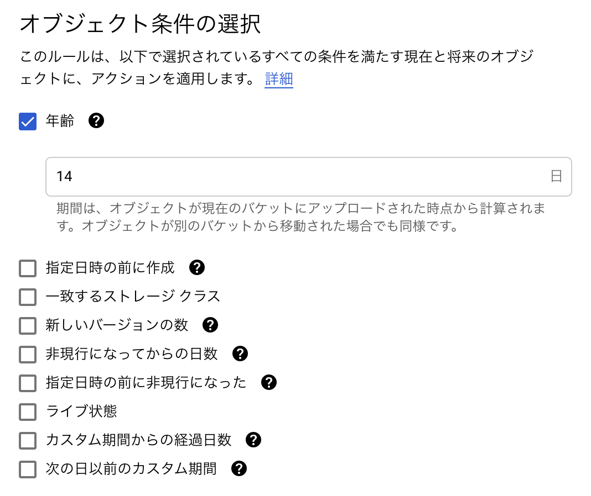

## はじめに
こんにちは！motoiです。弊社では、ほとんどすべてのWebフロント開発にFirebaseを導入しています。Firebaseでは、写真や動画、その他ファイルを管理するCloud Storage for FirebaseなるSDKが用意されていますが、肝心のファイルの保存先はGoogle Cloud Storage(以下GCS)であり、その容量は従量課金制です。つまり、アプリによってはどんどん課金額が上る可能性も😨
と言ってもフロント側でファイル削除の実装を組むのもな…ということで、GCSのライフサイクルを利用する方法を話します。
## バケット
オブジェクト(ファイルのこと)のライフサイクル、言わば寿命を設定することで、ファイルの自動削除が可能になります。その設定を行うために、まずはバケットという概念について触れておきます。

バケットとは、オブジェクトを格納する場所のことです。バケット1つ1つにディレクトリ構造を持ちます。以下の画像は、GCSのコンソール画面の一部です。FirebaseでCloud Storageの利用を開始すると、デフォルトでバケットで以下のようなバケットが作成されます。黒塗りの箇所は一意のプロジェクト名が入ります。



[[notice | オブジェクトとは]]
| [公式](https://cloud.google.com/storage/docs/how-to?hl=ja)では、保存されるファイルのことをオブジェクトと表現しており、これに倣います。

画像を見ればお分かりの通り、コンソールから新しいバケットを作成することが可能です。また、以下の画像のように、Firebaseのコンソールから作成することも可能です。



## GCSのライフサイクル設定
さて、ここからが本題です。なぜ本題の前にライフサイクルの話をしたかと言いますと、ライフサイクルが設定できるのはバケットごとだからです！ライフサイクルを設定する方法は、2つあります。

### 1. コンソールから設定
GCSのコンソールから下記画像のようにライフサイクルの条件を設定することができます。その条件も細かく設定することが可能です。詳しくは[こちら](https://cloud.google.com/storage/docs/lifecycle?hl=ja)をご参照ください。





### 2. コマンドで設定
Pythonアプリである、[gsutil](https://cloud.google.com/storage/docs/gsutil)を使います。例えば以下のようなJSONを用意します。

```json
{
    "lifecycle": {
        "rule": [
            {
                "action": {
                    "type": "Delete"
                },
                "condition": {
                    "age": 365,
                    "isLive": true
                }
            }
        ]
    }
}
```

そして、以下のコマンドを実行します。

```shell
gsutil lifecycle set [jsonのファイル名] gs://[設定対象のGCSのバケット名]
```

確認を行いたいときは以下です。

```shell
gsutil lifecycle get gs://[設定対象のGCSのバケット名]
```

## 使いみち
はじめこのライフサイクルを知らずに実装していたときは、すべて同じバケット内でディレクトリを分けて実装していました。途中でファイルの自動削除を行う必要性に気づき、GCSのライフサイクルにたどり着いたわけですが、ディレクトリごとに設定することができず泣きじゃくったことがあります😢

今は、仕様を決める段階で、ファイルの自動削除を行う必要があるかどうかあらかじめ検討し、必要のあるファイル群に対しては、バケットを分けて実装しています。また、開発環境と本番環境で設定したいライフサイクルが異なる場合もあるかと思います。フロント側で環境変数を使って、開発環境と本番環境で参照するバケットを変えることで、それぞれの環境に応じたファイルの自動削除の設定を行っています。

## Next Dev's HINT...
やっぱりGCP、Firebase関連の話おもしろいわーと改めて思ったので次もそれ関連の内容にしようかと思います。ではまた！

---
