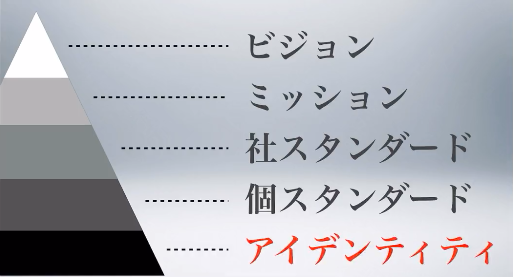

## はじめに
遅ればせながら、あけましておめでとうございます🐯年始、少しばたついていて更新が遅くなりました。今年は今まで以上に発信できればと思いますので、引き続きご愛顧の程、よろしくお願いいたします🥺

## ハッピーニューカマー！
そうです、1月4日より弊devチームに社員として3人目が加わりました！めでたい👏2020年4月にdevチームが私motoiとgoranに2人で始動してから約1年9ヶ月、待望の3人目です。その名も、[やっぴ](https://twitter.com/yapimaru_Eng)！24歳の新卒です。彼のプロフィールについては、そのうち彼自身が言ってくれるとして、とにかくエンジニアとしての素質に溢れた子で、まだ入社してから2週間程ですが、強烈なインパクトを残しています。そして何より一緒に仕事をしていて気持ちがいい！技術力やポテンシャル以上に弊社が大事にしている「人」の部分で、motoiもgoranも惹かれています。もちろん、僕ら以外の会社のメンバーも既にこんなツイートを…

<blockquote class="twitter-tweet">
まだそんなに話したことないけど、やっぴーはなんか愛くるしいんだよなー。 癒される😌 <a href="https://t.co/PPCqdOecPf">https://t.co/PPCqdOecPf</a>
&mdash; 條 靖哉（Seiya Jo） (@jooosei) <a href="https://twitter.com/jooosei/status/1482305597630717956?ref_src=twsrc%5Etfw">January 15, 2022</a></blockquote> 

とにかくこれからが楽しみで仕方ない弊devチームです！ご興味ある方、TwitterのDMでのご連絡お待ちしています！
## devチームの開発も加速させていきます
僕自身この度、devチームのマネジャーを拝命しました。弊社も50人近い会社になり、取締役が3人、マネジャーが僕含めて2人ですので、他の会社におけるマネジャーの役割はどうかはわかりませんが弊社のマネジャーは、自チームのマネジメントはもちろんのこと、経営にまで考えを及ぼさなければなりません。経営的視点を持ちながらdevチームを前へ推進させていき、その推進力が会社全体に伝わるような働きをしていくことがなお一層必要になる2022年だと考えています。

### ミッション・ビジョン・スタンダード・アイデンティティ
よく会社経営の話で出てくる「ミッション・ビジョン・バリュー」です。代表の平地が「バリュー」というワードに対してあまりピンとこず、「アイデンティティ」と弊社では呼んでいます(この辺の代表のワードセンスが僕はいつも好きなんです)。それに加えて弊社ではスタンダードというものがあります。

会社として、ミッション・スタンダードは決まっていました。そしてこの度、アイデンティティが決まり、更にもうすぐビジョンが決まろうとしています。これらを基にdevチームとしては昨年、**テクノロジーでクライアントの進化をカタチに**というミッションを掲げてやってきました。新しく決まったアイデンティティ、そして決まろうとしているビジョンを元にdevチームとしてのそれらを考えていければと思っています。弊devチームにおけるエンジニアは何が求められるのか、どういうビジョンの元、ミッションを遂行していくのか。メンバーとともに考えていきます。

### パートナーも続々と…
続々とパートナーさんもジョインしてくれています。自社アプリの開発に、僕の研究室時代の後輩1人に加えて、新たに2人、計3人のパートナーさんが働くことになりました🙌加えて、弊社はクラブチームさんの制作案件も多くやらせていただいているので、そちらのコーディングに2人+2つの会社さんがパートナーとして働いてくれています。もちろん、まだまだ一緒に働いてくれるパートナーさん(もちろん正社員も…)を募集中ですので、こちらも興味ある方いらっしゃったら、TwitterのDMにてご連絡ください📨

## さいごに
毎年言ってるのですが、2022年は本当に勝負の年です。厳しい場面もたくさんあるんだろうなと思いながら、でも確実に積み上がってきているものを土台に、さらなる進化を求めて走り続ける2022年にします。

どうぞよろしくお願いいたします！

---
