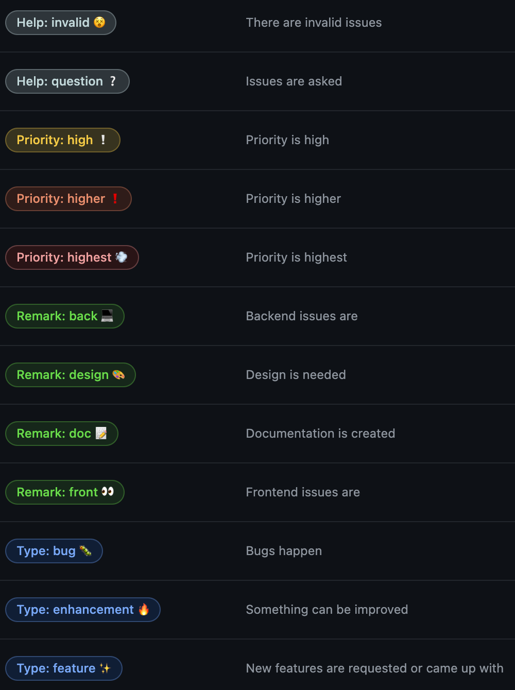
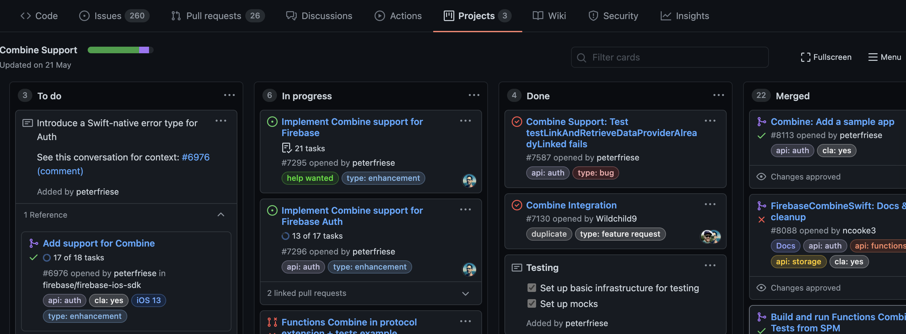

## 前回のおさらい
こんにちは！ユーロ2020も大詰め、ベスト8が出揃いましたね。フランス・クロアチアの敗戦はショッキングですが、楽しみが途絶えません。サッカー興味ない方ごめんなさい😓

さて、[前回](https://dev.plus-class.jp/team-mng-github/)の続きです。前回は僕らdevがどうGitHubを活用しているか、その走りを話しました。全体の概要を説明して、ブランチの切り方を紹介しましたが、今回は Issue、Pull Request、Projectの活用方法についてご紹介します。

特にProjectの活用方法については少し工夫をしているので、ぜひ最後までお付き合いください！

## Issueの活用
### 作成
やるべきタスクに対してIssueを作成します。内容は、まだチームメンバーが数人ということもあり、テンプレート化していません。取り組んでほしい内容をIssueにする際には、箇条書きで要件と、場合によっては画像で説明を与えます。

### ラベルの付与
以下がdevでデフォルトとして用意しているラベルです。GitHubでは、Organizationの設定の'Repository default'メニューで、デフォルトのラベルを設定できます。

いくつかポイントがあります。

- Typeラベルは必ずどれかひとつを設定する。
  - これがブランチ名になります。
- 優先度には`Low`や`Middle`を設けない。
  - 経験上、`Low`や`Middle`は手を付けないようになることが多く、Issueを作ればすべて`High`以上という意識を植え付けるために`High`, `Higher`, `Highest`にしました。
- 絵文字を入れて視覚的にもわかりやすく。色もこだわって。
- Remarkラベルは適宜必要があれば。

## Projectの活用
### Projectとは
営業やデザイナーとの課題管理については、基本的に[Trello](https://trello.com/ja)を使用していますが、devはやはりIssueをベースに課題管理をしたく、GitHubのProjectを用いることにしました。活用方法については最も議論を重ねてきたところかもしれません。

念の為、Projectについて説明をすると、各Issueをカードとして、「進行中」や「完了」等のリスト間を移動させることで、視覚的に現在をIssueを整理することが可能な機能です。以下の画像は、Firebaseの、あるリポジトリのProjectを拝借したものです。どのIssueが進行中で、どのIssueが顕在化されているのかひと目で分かります。

### 活用方法

このProjectはリポジトリ毎に作成することもできますし、Organizationに作成することもできます。初めは各リポジトリにおいて、Projectを使っていたのですが、それだと、今devチームが全体でどれだけのIssueを抱えているのか、をクイックに把握することができませんでした。

そこで、**各リポジトリでProjectを作成するのは禁止し、OrganizationのProjectのみを使うことで、すべてのリポジトリのIssueをチームで確認できるようにしました**。そしてこのProjectを**TPM(Team Progress Management)**と名付け、隔日で開催しているチームミーティングで確認をしています。

devでは以下のリストを用意しています。
- Backlog 👀
  - 割と長めの期間を見込んで取り組むIssue
- To do 🔥
  - 直近で取り組むべきIssue
  - Issueが作成されれば自動でこのリストに入る
- In progress 🧑‍💻
  - 進行中のIssue
  - ブランチを切る前にこのリストにIssueを移動させ、取組中であることを明示する
- Under review 👨‍🏫
  - PRを投げレビュー中のIssue
- Implemented 🙆‍♂️
  - CloseしたIssue
  - IssueをCloseすると自動的に入る
- Public ✨
  - 実際に本番環境へ反映されたIssue
- Staging ✔️
  - まだ本番公開前のプロジェクトでステージング環境が最終地点の場合は、Public✨ではなくこちらに入る

### 工夫していること
Projectの活用方法で工夫していることがあります。上記の通り、本番反映されてCloseしたIssueは自動でImplemented🙆‍♂️に移動します。ではPublic✨はいつ使うのか、と思われた方もいるのではと思います。

devチームでは隔日で定例会をしていて、その場でImplemented🙆‍♂️に移動したIssue(つまり完了して本番反映も既にされているIssue)を確認します。そして、それらのIssueでどんなことを取り組んだか、復習をしながらその場でPublic✨に移動させます。そうすることで、勉強にもなりますし、何より少しでも**チームとして前進している雰囲気をメンバーと共有**することができます。**何をしたか、何ができるようになったかをより大切にするため**にこんな工夫をしています。

実際やり始めてから、チームの技術的な基礎体力も上がりましたし、案件に対する意識も高まりました。この思想は文化としてこれからも継続していきたいと考えています。

## Pull Request(PR)の活用
GitHubの目玉機能の1つと言えるPull Requestをdevチームでも活用しています。一般的な使い方をそのまま踏襲していますが、必ず元のIssueと紐付けることにしています。そうすることで、PRがMergeされCloseになれば、紐付けられたIssueも自動でCloseになり、ProjectでもImplemented🙆‍♂️に移動してくれます。

また、Firebase HostingとGitHub Actionsを活用して、PRを投げた際に自動でフロント確認用のURLが発行されるようにしています。これについては次回詳しく話をします。

## Next Dev's HINT...
今回は、GitHubの基本機能である、Issue、Project、Pull Requestについて、工夫していることを話しました。次回は、GitHub Actionsの話をする予定です。Firebase × GitHubがアツい。ぜひお楽しみに！

---
