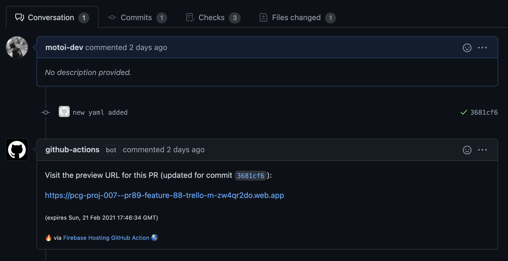

## 前回のおさらい
こんにちは！いきなり夏。こんな暑い中でも連休はサッカーに明け暮れるであろうmotoiです。さて、[前回](https://dev.plus-class.jp/team-mng-github-2/)の続きです。Issue管理やProjectの活用方法について話した前回。今回は、予告通り、GitHubとFirebaseのインテグレーションがハンパないのでご紹介します。コードも入り、少々長いですがお付き合いのほど…

## 前提
### Firebaseとは
[Firebase](https://firebase.google.com/?hl=ja)は、Googleが提供するBaaS(Backend as a Service)です。Firestoreと呼ばれるNoSQLのデータベースやFirebase Hostingなるホスティングサービス、更にはログイン機能を実装可能なFirebase Authentication等、Webアプリを開発する上で必要なものが一通り揃っています。無料枠も大きく、小規模であればほとんど無料枠内で開発ができちゃいます。また、管理画面のUIUXもわかりやすく、弊社devチームでは発足当初からほとんどすべてのサイト制作やアプリ制作をFirebaseを基盤として作成してきました。

### GitHub Actionsを使ったCI/CD環境
devではサイト制作も含めて、JSのフレームワークを用いて開発を行っています。用途に応じて、Next.jsやGatsby.js、Nuxt.js等のフレームワークを使い分けて開発しています。これらフレームワークは、「ビルド」というコンパイルのような工程を経て、実際にサーバーにホスティングするためのhtml, css, jsのファイル群を生成します。ビルドを自動化したものをCI(Cotinuous Integration)、ビルドされたファイル群のホスティングを自動化したものをCD(Continuous Delivery)と呼びます。

GCPのCloud BuildやCircleCI等、CI/CDサービスはいくつかありますが、弊社devでは、2019年11月にリリースされた[GitHub Actions](https://github.co.jp/features/actions)を使ってCI/CD環境を構築しています。指定したブランチへのpushをフックにActionsが走り、ビルドとホスティングまで完結してくれます。

## GitHub × Firebase
さて、本題です。2020年10月、GitHubとFirebaseの連携が更に強化されました。Firebaseには**プレビューチャンネル**という機能があり、これは特定の期間のみ有効なランダムなURLをFirebaseが用意してくれる機能で、デバッグや期限付き公開に有効です。この機能とGitHub Actionsを連携させることで、Actionsによるビルドとプレビューチャンネルの発行が同時に行われます。つまり、例えば、PR作成と同時にプレビューチャンネルが自動で発行されるので、レビュアーはマージの前にそのURLでフロントの動作を確認することができます。

特にフロントのアプリ開発では、実際にサーバーにホスティングされたときの動作のデバッグが重要になるので、非常に便利です。PR毎にプレビューチャンネルが発行されるので、キャッシュによる誤動作の心配もありません。更に、Firebaseのホワイトリストにも自動で登録されます。Amazingですね😎

[[alert | プレビューチャンネルの注意点]]
| プレビューチャンネルは、そのURLを知っている人なら誰もアクセスできるので、取り扱いには注意しましょう。

### 手順サマリー
手順はいたってシンプル。

1. コマンドの実行
2. yamlの設定

これだけ。ビルドやホスティング、slackへの通知など、yamlの設定をカスタマイズする必要がなければ、コードレスでCI環境の構築およびプレビューチャンネルのURL発行までたどり着けます。Firebase恐ろしい。

とはいえ、

- buildの設定
- slackへの通知

ここらへんはカスタマイズしたいところですね。加えて、上記の実現に`FirebaseExtended/action-hosting-deploy@v0`という拡張機能を使うのですが、そのオプションの説明も後ほど行います。

### コマンドの実行
まずは以下のコマンドを実行します。

```bash
// Firebase Hosting未設定の場合
firebase init hosting

// Firebase Hosting設定済みの場合
firebase init hosting:github
```

前者に関しては[公式](https://firebase.google.com/docs/hosting/quickstart?hl=ja)や[この辺](https://qiita.com/rubytomato@github/items/b83caa01fc9c4993f526)の記事を参考にしてください。

そうすると、ブラウザでGitHubとの連携を許可するかどうか聞かれるので許可します。

[[notice | Organizationのリポジトリとの連携]]
| Organizationのリポジトリとの連携をしたい場合、Organizationで許可をする必要があります。コマンド後に開かれる画面でできますが、以下の手順で後から設定も可能です。
| 
| - GitHubにログインし、自分のアイコンを押して出てくるプルダウンメニューから'Settings'をクリック
| - 'Applications'をクリック
| - 'Authorized OAuth Apps'タブをクリック
| - 'Firebase CLI'をクリック
| - 下部の'Organization access'で許可するOrganizationをGrant

さて、許可したら、ターミナルに戻りいくつか質問に答えていきます。以下、参考にしてください。

| 質問 | 質問訳 | 回答例 |
| -------- | -------- | -------- |
| For which GitHub repository would you like to set up a GitHub workflow?     | GitHub Actionsを設定したいリポジトリはどれですか？     | (組織名)/(リポジトリ名), (アカウント名)/(リポジトリ名)     |
| Set up the workflow to run a build script before every deploy? | buildコマンドを毎回実行しますか？ | VueやReact等のJSフレームワークを使っていてビルドが必要な場合はYes |
| What script should be run before every deploy? | (上記Yesの場合)どのコマンドを実行しますか？ | yarn generate |
| Set up automatic deployment to your site’s live channel when a PR is merged? | プルリクエストがマージされれば、自動的に本サイトのURLにデプロイしますか？ | Yes or No |
| What is the name of the GitHub branch associated with your site’s live channel? | 本サイトのブランチ名はなんですか？ | master |

2問目移行は自動で作成されるyamlのコマンドなので、後からyamlファイルを編集することで容易に変更が可能です。

上記の質問に答えれば、`firebase-hosting-pull-request.yml`と`firebase-hosting-merge.yml`の2つのファイルが`.github/workflows`の中にできているはず。例えば前者の中身を見てみると、

```yaml
name: Deploy to Firebase Hosting on PR
'on': pull_request
jobs:
  build_and_preview:
    runs-on: ubuntu-latest
    steps:
      - uses: actions/checkout@v2
      - run: 'yarn generate'
      - uses: FirebaseExtended/action-hosting-deploy@v0
        with:
          repoToken: '${{ secrets.GITHUB_TOKEN }}'
          firebaseServiceAccount: '${{ secrets.FIREBASE_SERVICE_ACCOUNT_~ }}'
          projectId: (プロジェクトID)
        env:
          FIREBASE_CLI_PREVIEWS: hostingchannels
```

となっています。

`secrets.GITHUB_TOKEN`はGitHubで予約されている環境変数、`secrets.FIREBASE_SERVICE_ACCOUNT_~` はリポジトリに自動作成された環境変数です。GitHubのコンソールで、Settings/Secretsに環境変数が保存されるのですが、確かにに自動で作成されていました。


これだけで、yamlで指定したブランチへのpushをフックにGitHub Actionsのビルドが走り、ビルドが終了すると、Firebaseが自動でプレビューチャンネルを発行してくれます。PR上では以下のようになります。



Awesome!!!

### yamlの拡張
ここまでコードレスで実現しましたが、先述したとおり、[Firebase Hostingに様々なオプション](https://github.com/FirebaseExtended/action-hosting-deploy)を使ってyamlファイルを拡張することでいろんな事ができます。その一部を紹介します。

#### プレビューチャンネルの有効期限の指定
生成されたプレビューチャンネルは、デフォルトでは1週間が有効期限です。それを`FirebaseExtended/action-hosting-deploy`のオプションを使って拡張することができます。以下例です。

```yaml
- uses: FirebaseExtended/action-hosting-deploy@v0
    with:
        repoToken: '${{ secrets.GITHUB_TOKEN }}'
        firebaseServiceAccount: '${{ secrets.FIREBASE_SERVICE_ACCOUNT_~ }}'
        projectId: (プロジェクトID)
        expires: 3d
```

他には、mergeのyamlでそうなっているように、`channelId`を`live`にすると、本番用のURLにホスティングされます。

[[alert | 矛盾するオプション指定におけるエラー]]
| 例えば上記、`channelId: live` にして、expiresオプションを付与するとエラーになります。本番用のURLに期限をつけることはできないので当然ですが、このように組み合わせ次第ではエラーになるものがあります。

#### Slack通知
devチームでは、ビルドのステータスをSlackで通知しています。ビルドに成功し、プレビューチャンネルが生成されれば、そのURLをSlackにも投げるようにしています。以下のように、[Outputs](https://github.com/FirebaseExtended/action-hosting-deploy#options)オプションを使えば、生成されたURLを取得し、Slackに投げることができます。以下、実際に使っているyamlの例です。

```yaml
- name: Produce preview channel
  uses: FirebaseExtended/action-hosting-deploy@v0
  id: firebase_hosting_preview // idをつけて、後に使えるように
  with:
    repoToken: '${{ secrets.GITHUB_TOKEN }}'
    firebaseServiceAccount: '${{ secrets.FIREBASE_SERVICE_ACCOUNT_PCG_PROJ_007 }}'
    channelId: development
    projectId: pcg-proj-007
    expires: 3d
  env:
    FIREBASE_CLI_PREVIEWS: hostingchannels
- name: Slack Notification on SUCCESS of Deploy
  if: success()
  uses: tokorom/action-slack-incoming-webhook@master
  env:
    INCOMING_WEBHOOK_URL: ${{ secrets.SLACK_WEBHOOK }}
  with:
    text: "❤ SUCCESSFULLY deploy to Firebase. All done with no error!"
    attachments: |
      [
        {
          "color": "good",
          "author_name": "${{ github.actor }}",
          "author_icon": "${{ github.event.sender.avatar_url }}",
          "fields": [
            {
              "title": "Hosting URL",
              "value": "${{steps.firebase_hosting_preview.outputs.details_url}} \nexpired on ${{steps.firebase_hosting_preview.outputs.expire_time}}"
              // steps.(id名).(Outputs名)でアクセス
            }
          ]
        }
      ]
- name: Slack Notification on FAILURE of Firebase Deploy
  if: failure()
  uses: tokorom/action-slack-incoming-webhook@master
  env:
    INCOMING_WEBHOOK_URL: ${{ secrets.SLACK_WEBHOOK }}
  with:
    text: "😢 Deploy to Firebase FAILS..."
```

## Next Dev's HINT...
いかがでしたでしょう。もはや一度使い始めると、離れられないくらい日々の開発に浸透しています。次回は…ちょっとまだ未定です笑。Firebase関連の短めのやつ書きますきっと。ではまた！

---
