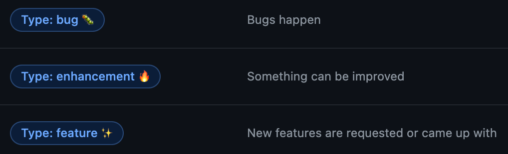

## devチームをつくる(0)
こんにちは！本格的に梅雨入りでしょうか。実は雨はそんなに嫌いじゃないmotoiです。[はじめまして](https://dev.plus-class.jp/hello-world/)が終わって一発目の投稿、じめっと書いていきます。

昨年4月(正確に言うとコロナの影響で3月)にdevチームが発足し、案件に取り組みながらも、並行してdevチームをつくっていく必要がありました。とても大事なミッションです。もちろん**チームは生き物**ですから、これに終わりはありませんが、今行っているチームの運用方法について紹介していけたらと思います。

(ちなみにタイトルのナンバリングは、時系列とは関係ございません。気分です。)

## GitHub最強
今のところはそう思っています笑。GitHubにも様々な機能があって、僕らが現在主に使っている機能は以下です。

- Code・ブランチ管理
  - ほとんどのソースコードをプライベートリポジトリで管理しています。
- Issues・Pull Requests(PRs)・Projects
  - Issueを作成し、ブランチを切って、PRを作成する。よくある使い方です。
  - Projectで進捗状況を可視化しています。オートメーション機能も使っています。
- Actions
  - JSのフレームワークを使うことも多く、ビルドからホスティングまでActionsで行っています。
- Firebase × GitHubのプレビューチャンネル
  - PR作成時、ビルドが成功するとランダムなURLが生成されます。このURLでUIUXを確認できるので大変重宝しています。
- Wiki(廃止)
  - 一時期使っていましたがやめました。
- Discussions(ペンディング)
  - イマイチ使い所がわからずペンディング。

上から順に説明していきます。今回はブランチ管理についてです。

## ブランチ管理
基本的にすべてのリポジトリが以下のレギュレーションを準拠しています。

1. リポジトリを作成した管理者は初めに `master`ブランチ、`development`ブランチを作成する。必要な場合は、`staging`ブランチも切る。
2. 初めてリポジトリに参加したメンバーは`master`ブランチをクローンする。
3. 作業をするときは、必ずIssueを立てて、`(IssueのType名)/#(Issue番号)_(内容が端的に分かる英単語)`ブランチを`master`ブランチから切ってそこで作業をする。ex.)feature/#12_select_player (IssueのType名については後述)
4. `development`ブランチは好きにマージしてよい。
5. 上記ブランチでの開発が終われば、`master`ブランチあるいは`staging`ブランチにPRを送信する。
6. ReviewerはFirebaseが発行するプレビューチャンネルを活用し、コードのみならずUIUXのチェックも行う。(めちゃくちゃ便利！設定方法含めて記事にします)
7. 問題なければマージする。
8. マージ先が`staging`ブランチだった場合は、Staging環境でReviewerがチェックをし問題なければ`master`ブランチにマージする。

基本的にはみなさんがよくやられている方法と同じかなーって思ってます。

[[info | IssueのType名]]
| IssueのType名は、IssueのLabelが入ります。次の記事で詳しくは紹介しますが、Labelの中に以下の画像の3つを用意していて、Issueには必ずどれかひとつを付与することになっています。付与されたLabel名に基づいてブランチ名を決めます。

## Next Dev's HINT...
本当はこの記事の中にIssueやPR、Projectの使い方も書きたかったのですが、少しボリューミーになりそうで次回に回しました。ではまた！

---
