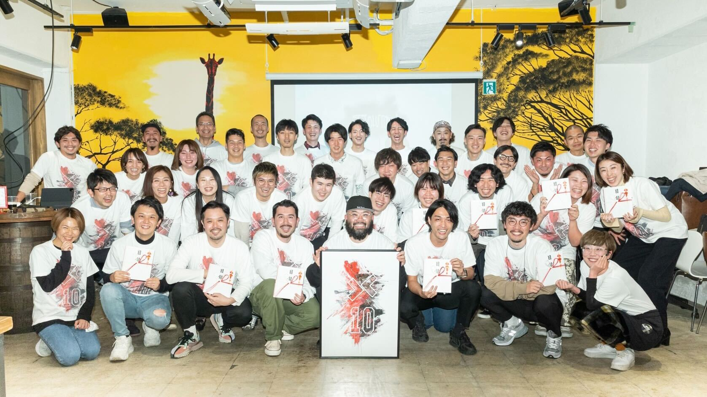

こんにちは。`GORAN` です。今日は弊社および弊チームについて語ろうと思います。

## はじめに

### 弊社とは
2011年12月1日に設立された[株式会社プラスクラス](https://plus-class.co.jp/)（以降プラスクラス）と、2016年2月3日に設立された[プラスクラス・スポーツ・インキュベーション株式会社](https://plusclass-sports-incubation.co.jp/)（以降PSI）の2社がありまして、どちらも弊社です。2社あわせて**プラスクラスグループ=弊社**という構図。今でこそスポーツのイメージが強い弊社ですが、それはPSIの方の知名度が高まってきたからでありまして、元々はSEOを中心にしたWEBマーケのコンサルを強みにしていた会社から成り立っています。

[[simple]]
|詳しい設立の経緯や[代表平地](https://twitter.com/halloffame81)の経歴については[バスケでプロになるはずが、気づけば腹痛でトイレにこもる会社員になっていた](https://note.com/halloffame81/n/nf3f2c5b7dfeb)をご覧ください。

[[notice | 祝10周年]]
|2021年11月30日をもってまる**10年**、2021年12月1日をもって第11期目に突入しました！めでたい！！
|

### 弊チームとは
`devチーム`として発足されたのはチームリーダーの[motoi](https://twitter.com/motoi_dev)がジョインした2020年3月なので、社内における正式なチームとしてはまだ日が浅いですが、私``GORAN``は大学3年の終わり（2016年）からインターンとしてジョインしてますし、`motoi`はなんと1期目からインターンとして参画してます（現役社員の中では平地の次に長い）ので、構成員は（社歴で言うと）中堅と古参という不思議なチームです。

## Biz起点・Biz中心の組織
さて、ここからが本題です。

はじめに設立されたプラスクラスは当初社員が代表平地のみのワンマンコンサル会社でしたので、当然Bizに起点があります。そこから「集客・制作・解析」という三本を柱にWEBの市場で規模を拡大させ、スポーツ事業を立ち上げ、法人化してさらに大きくなってきたわけですが、やはりメンバーとしてはBiz（コンサルタント・セールス・アナリスト）が中心でした。もちろん制作（クリエイティブ）に強みを作っていく過程で、デザイナーやビデオグラファーもジョインしていますが、**エンジニアの採用というのは2020年の弊チーム発足までゼロだった組織です**。

## devチームはイキイキしている
弊社は設立から長い間エンジニア社員がゼロの組織でありましたので、エンジニアにとっての「働く環境」は整っていませんでした。

それでも弊チームは発足当初からとてもイキイキしてまして、ありがたいことに社内でも評価をいただけているチームになってきています。
[[info]]
|毎年期末（11月末）にある全社報告会での表彰では、初年度の去年はそれぞれ別の賞を受賞。[今年度は`motoi`がMVPに選出されました！](https://twitter.com/halloffame81/status/1465883837875900417?s=20)素晴らしい活躍！！

「なぜ環境が整っていない組織でのびのびやれているのか」というのを考えたのが今回の主旨なんですけれども、その理由は単に**のびのびやれる環境を作ることができている**からであって、それを実現できているのは**理解のある組織の柔軟な意思決定**によるものだと、（今のところ）結論づけています。

先日、[スタートアップのエンジニアにとって、丁寧に会話ができるBizがいることが福利厚生](https://zenn.dev/leaner_tech/articles/20211020-as-a-startup-engineer)という記事を読んでいて「ふむふむたしかに」という気持ちになっていたのですが、こちらの記事はエンジニアチームが既に存在していることが前提でして、ゼロからチームを作っていくときには、いかに**既存の組織の中に自分たちの望む形の環境を作っていけるか**というところが重要で、その実現には意思決定者の理解が必要になってきます。

幸いなことに社歴長めのメンバーで構成される弊チームは既存メンバー（経営陣含め）とのコミュニケーションコストが低い分、かなり自由度の高い形で組織の意思決定に関わることができていると感じています。

その結果として、「働く環境」という意味では発足当初から社内で様々な議論をさせていただき、既に以下の2点が整っています。（もちろんまだ発展途上）

1. 福利厚生
2. 評価制度

### 福利厚生
エンジニアにとって**支給されるデバイスへの満足度は会社への満足度にほぼ直結します**。

弊社では基本的にエンジニアには以下のデバイスが支給されます。

- PC（好きなスペック）
- ディスプレイ（4K 27inch）
- キーボード
- マウス or トラックパッド

お陰様でデスク周りは非常に充実して、快適極まりないです。（今度それも記事にしよう）

他にも

- バックアップ用の外付けHDD
- 毎月の書籍代支給
- 有料セミナーへの参加費補助

などなど、かなり充実した福利厚生が提供されています。

[[notice | リモート & フレックス]]
|おまけに弊社は勤務地に縛りが（ほぼ）ありません。私`GORAN`も札幌の自宅でのびのびやらせてもらっております。また、フレックスタイム制が導入されいるので、勤務時間もかなり柔軟です。最高。至高。

### 制度
エンジニアにとって**給与への満足度は会社への満足度に直結します**。

これはdevチームに留まる話ではないですが、昨年度より評価制度が正式に導入されました。弊社のスタンダードである「進化」を全メンバーが体現できるよう、**個人の目標**と**会社が個人に求めること**とを擦り合わせる形で（双方向コミュニケーションのもと）目標が設定され、定期的に個人の「進化」を観測できるような仕組みです。
弊社のスタンダードや評価制度の詳細はまた別記事にしようと思いますが、この制度の導入によって、エンジニアにとっても**評価に納得しやすい仕組み**が制定されました。この評価は給与とも紐づくものになっているので、**評価への納得感＝給与への納得感**と言える状態になっています。

## 課題がないわけではない
上述の通り、devチームがのびのびやっていけている現状というのは、既存メンバーを含めた組織全体へのこれまでの関係値（信頼）の上に成り立っています。もちろんそれはdevチームとして継続して積み上げるべきものですが、これから入ってくる未来のメンバーは持ち得ないステータスなので、そこに格差が生じる可能性を孕んだ状態は健全とは思えません。

また、例えば、スポーツビジネスに魅力を感じて入ってきてくれるBizの新規メンバーのほとんどは「WEBとはなんぞや」状態ですので、リテラシの差によって、特に制作系の与件に取り組むタイミングで確実に躓きます。逆にエンジニア側はBizが向き合っているクライアントの存在や与件の意義に対する感度が低く、議論の中でお互いの本質を見失いがちです。

こうした他部署との新規メンバー同士の接点を考えたときに、エンジニアとBizの壁が大きくなることは容易に予想できて、そこでは[上述の記事](https://zenn.dev/leaner_tech/articles/20211020-as-a-startup-engineer)にある問題に私たちも直面することになろうかと思います。

[[simple]]
|実は既に直面していて、日々改善を続けています。その葛藤も経緯とともに発信していけたらと思っています。

### エンジニアからBizの側面を中和していく
今のところはこれが上記の課題に対する答えです。「**エンジニアの思考に歩み寄れるBizを生み、Bizに歩み寄れるエンジニアを育む。**」という思想のもと、ジェネラリストとスペシャリストの双方をeducateできる環境を作っていこうと、devチームでは日々活発に議論を繰り返しています。

## おわりに
私も`motoi`も在籍している時間が長い分、会社に愛着がありますので、多少の認知バイアスは否定できませんが、なかなか良い会社・良いチームになってきてるんじゃないかなという実感があります。そこそこ長くなってしまいましたが、まだまだ書けてないところは（良いも悪いも）沢山あるので、カルチャーの発信という文脈でも執筆は続けないとですね。

### 積極採用中
そんなdevチームでは、正規メンバー・パートナー・業務委託などの形態問わず、働く仲間を大募集中でございます。

- スタートアップでエンジニアチームをスタートアップさせたい
- スポーツビジネスが気になってる
- WEBが好き

上記に心当たりのある方、是非DMくださいませー。

---